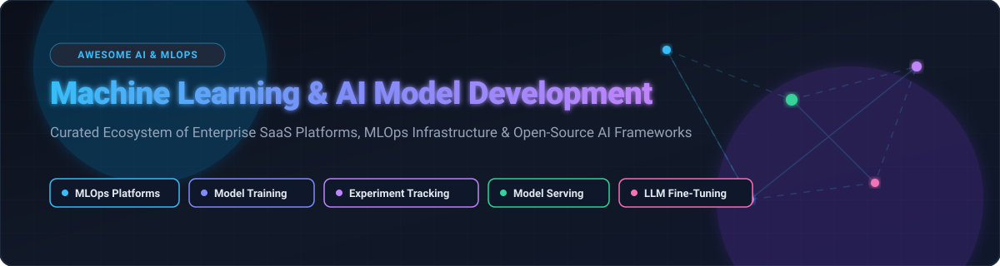

# Awesome Machine Learning & AI Model Development 🚀

**Curated Directory of Commercial SaaS Platforms & Open-Source AI Frameworks**  
*Comprehensive resource for End-to-End MLOps, Large Language Model (LLM) Fine-Tuning, Distributed Model Training, Experiment Tracking & Enterprise AI Deployment.* 🧠⚡

---

## 💡 Overview & Market Landscape

This repository provides an authoritative, community-curated directory of enterprise **commercial SaaS ML platforms** and **open-source AI development tools** covering every phase of the artificial intelligence model lifecycle:
- 🏷️ **Data Annotation & Prep**: Data labeling, synthetic data generation, and feature engineering.
- 🏋️‍♂️ **Model Training & Fine-Tuning**: Distributed GPU training, LoRA/QLoRA fine-tuning, and hyperparameter tuning.
- 📊 **Experiment Tracking & Model Registry**: Metric logging, artifact versioning, and lineage tracking.
- 🚀 **Model Serving & Inferencing**: High-throughput LLM serving, low-latency microservices, and edge deployment.
- 🛡️ **MLOps & Governance**: Model monitoring, drift detection, feature stores, and enterprise AI compliance.

---

## 📑 Table of Contents

- ☁️ [SaaS & Hosted AI Platforms](#%EF%B8%8F-saas--hosted-ai-platforms)
- 🔓 [Open-Source GitHub Projects](#-open-source-github-projects)
- 🛠️ [Architecture & Framework Selection Guide](#%EF%B8%8F-architecture--framework-selection-guide)
- 🤝 [How to Contribute](#-how-to-contribute)
- 💖 [Support & Community](#-support--community)
- ⭐ [Star History](#-star-history)
- 📜 [Disclaimer](#-disclaimer)

---

## ☁️ SaaS & Hosted AI Platforms

> 📈 **Market Overview & Market Size**: The global Machine Learning Development & MLOps Market is estimated at **~$38.5 Billion in 2026** and is projected to reach **$120+ Billion by 2030** growing at a CAGR of **~31.8%**. The market infrastructure layer is **moderately concentrated** at the cloud compute level (dominated by hyperscalers Microsoft, AWS, and Google Cloud), while remaining **highly fragmented** across specialized MLOps, experiment tracking, automated data labeling, and niche LLM developer platforms.

The following commercial platforms are sorted by **Company Valuation / Market Capitalization (descending)** 🏆:

| Platform | Company Valuation / Revenue | Starting Price | Free Tier / Trial Limits | Key Capabilities & Ideal Use Cases |
| :--- | :--- | :--- | :--- | :--- |
| **[Microsoft Azure Machine Learning](https://azure.microsoft.com/en-us/products/machine-learning/)** | 🔷 **$3.1 Trillion** Market Cap *(Azure ~$75B+ Rev)* | **$0.096 / hour** *(Standard_DS2_v2 instance; compute pay-as-you-go)* | **$200 free credit** (30 days) + 12 months free select services | Enterprise MLOps platform integrated with Azure OpenAI, enterprise security, and Azure Hybrid Benefit compute. |
| **[Amazon SageMaker AI](https://aws.amazon.com/sagemaker/)** | 🟧 **$2.1 Trillion** Market Cap *(AWS ~$105B+ Rev)* | **$0.05 / hour** *(ml.t3.medium notebook; pay-as-you-go)* | **250 hours/month** free ml.t3.medium notebook for first 2 months | End-to-end managed ML platform covering labeling, training, feature stores, and automated model endpoints. |
| **[Google Cloud Vertex AI](https://cloud.google.com/vertex-ai)** | 🔴 **$2.0 Trillion** Market Cap *(GCP ~$40B+ Rev)* | **$0.045 / hour** *(n1-standard-1 compute; Gemini API $0.00015/1k tokens)* | **$300 free credits** (90 days) for new GCP accounts | Unified AI platform deeply integrated with BigQuery, Gemini models, AutoML, and custom training pipelines. |
| **[Databricks ML](https://www.databricks.com/)** | 🧱 **$43.0 Billion** Valuation *($2.4B ARR)* | **$0.15 / DBU** *(Databricks Unit per hour on Pay-As-You-Go)* | **14-day free trial** with $400 DBU compute credit | Lakehouse-native AI platform built around MLflow and Delta Lake for large-scale enterprise data & ML engineering. |
| **[Scale AI GenAI Platform](https://scale.com/)** | ⚖️ **$13.8 Billion** Valuation *($750M+ ARR)* | **$0.08 / labeled item** *(Rapid labeling starter pay-as-you-go)* | **$250 free labeling credits** upon account registration | Enterprise data annotation, RLHF human feedback, model evaluation, and Generative AI customization. |
| **[Hugging Face Enterprise Hub](https://huggingface.co/enterprise)** | 🤗 **$4.5 Billion** Valuation *($100M+ ARR)* | **$20 / user / month** *(Enterprise Hub subscription; PRO $9/mo)* | **Free Forever** public/private repository hosting & 30k free Space build min/mo | Collaborative repository hub for open models, dataset storage, private model registries, and inference endpoints. |
| **[DataRobot](https://www.datarobot.com/)** | 🤖 **$2.8 Billion** Valuation *($300M+ ARR)* | **$150 / user / month** *(Cloud Starter subscription)* | **14-day free trial** with full access to automated ML & deployment | Automated Machine Learning (AutoML) platform with automated feature engineering, compliance reporting, and governance. |
| **[Domino Data Lab](https://www.dominodatalab.com/)** | 🀄 **$1.5 Billion** Valuation *($100M+ ARR)* | **$250 / user / month** *(Domino Cloud environment starter)* | **14-day free trial** with pre-configured cloud workspace access | Enterprise MLOps orchestration for regulated industries (pharma, finance) requiring strict audit trails and reproducibility. |
| **[Weights & Biases (W&B)](https://wandb.ai/)** | 🐝 **$1.2 Billion** Valuation *($100M+ ARR)* | **$50 / user / month** *(Team Edition; excess usage pay-as-you-go)* | **Free Forever** for individuals (100GB storage, 1 user, unlimited projects) | The developer standard for experiment tracking, hyperparameter sweep visualization, model lineage, and evaluation. |
| **[Run:ai](https://www.run.ai/)** | 🟢 **$700 Million** *(Acquired by NVIDIA)* | **$0.05 / GPU hour** *(Self-managed cluster compute license)* | **30-day free trial** supporting up to 8 GPU nodes | Dynamic GPU orchestration and fractioning platform maximizing GPU utilization across multi-tenant ML workloads. |

---

## 🔓 Open-Source GitHub Projects

The open-source AI ecosystem powers the majority of modern machine learning research and production systems. 🌟

The open-source repositories below are sorted strictly by **GitHub Star Count (descending)** 👑:

| Project & Repo | Star Badge | License | Description & Primary Strengths |
| :--- | :--- | :--- | :--- |
| **[TensorFlow](https://github.com/tensorflow/tensorflow)** |  | Apache-2.0 | Google's end-to-end machine learning platform for large-scale production training, mobile (TF Lite), and web deployment. |
| **[Ollama](https://github.com/ollama/ollama)** |  | MIT | Get up and running with Llama 3, Mistral, Gemma, and other large language models locally on macOS, Linux, and Windows. |
| **[Hugging Face Transformers](https://github.com/huggingface/transformers)** |  | Apache-2.0 | State-of-the-art Machine Learning for Pytorch, TensorFlow, and JAX with thousands of pre-trained models for NLP, vision, and audio. |
| **[LangChain](https://github.com/langchain-ai/langchain)** |  | MIT | Framework for developing applications powered by language models, agents, prompt management, and RAG retrieval pipelines. |
| **[LLMs-from-scratch](https://github.com/rasbt/LLMs-from-scratch)** |  | Apache-2.0 | Educational step-by-step implementation of a ChatGPT-like LLM built in PyTorch from scratch by Sebastian Raschka. |
| **[PyTorch](https://github.com/pytorch/pytorch)** |  | BSD-3-Clause | The leading deep learning framework featuring dynamic computation graphs, extensive GPU acceleration, and rich ecosystem support. |
| **[vLLM](https://github.com/vllm-project/vllm)** |  | Apache-2.0 | High-throughput and memory-efficient LLM serving engine featuring PagedAttention for maximum inference concurrency. |
| **[scikit-learn](https://github.com/scikit-learn/scikit-learn)** |  | BSD-3-Clause | The foundational Python module for classical machine learning algorithms, classification, regression, clustering, and preprocessing. |
| **[Streamlit](https://github.com/streamlit/streamlit)** |  | Apache-2.0 | Turn Python scripts into interactive web applications for data science demos, internal dashboards, and model evaluation interfaces. |
| **[Ray](https://github.com/ray-project/ray)** |  | Apache-2.0 | Unified framework for scaling AI and Python applications from laptop to cluster, supporting distributed training (Ray Train) and serving (Ray Serve). |
| **[Gradio](https://github.com/gradio-app/gradio)** |  | Apache-2.0 | Build and share custom machine learning web apps and UI demos in Python with just a few lines of code. |
| **[XGBoost](https://github.com/dmlc/xgboost)** |  | Apache-2.0 | Scalable, portable, and distributed gradient boosting (GBDT, GBRT, GBM) library for structured and tabular data modeling. |
| **[MLflow](https://github.com/mlflow/mlflow)** |  | Apache-2.0 | Open-source platform for the end-to-end ML lifecycle: experiment tracking, model registry, prompt evaluation, and artifact storage. |
| **[LightGBM](https://github.com/microsoft/LightGBM)** |  | MIT | Fast, distributed, high-performance gradient boosting framework based on decision tree algorithms by Microsoft. |
| **[DVC (Data Version Control)](https://github.com/iterative/dvc)** |  | Apache-2.0 | Git for data & ML models: version large datasets, ML pipelines, and models directly alongside source code. |
| **[Optuna](https://github.com/optuna/optuna)** |  | MIT | Automatic hyperparameter optimization framework featuring define-by-run syntax, efficient pruning algorithms, and parallel sampling. |
| **[BentoML](https://github.com/bentoml/BentoML)** |  | Apache-2.0 | Software development kit for building AI applications and deploying machine learning models into production REST/gRPC endpoints. |
| **[Evidently AI](https://github.com/evidentlyai/evidently)** |  | Apache-2.0 | Open-source ML and LLM evaluation framework to analyze, monitor, and test data quality, model drift, and RAG performance. |
| **[H2O-3](https://github.com/h2oai/h2o-3)** |  | Apache-2.0 | In-memory, distributed machine learning platform offering AutoML algorithms for tabular data in Python, R, and Java. |
| **[Feast](https://github.com/feast-dev/feast)** |  | Apache-2.0 | Production-grade open-source feature store for machine learning, managing offline training features and real-time online feature serving. |
| **[KServe](https://github.com/kserve/kserve)** |  | Apache-2.0 | Standardized Serverless ML Inference Platform built for Kubernetes, providing autoscaling (down to zero) and multi-model serving. |
| **[Deep Java Library (DJL)](https://github.com/deepjavalibrary/djl)** |  | Apache-2.0 | Engine-agnostic Java framework for deep learning, enabling Java developers to train and serve PyTorch/TensorFlow models seamlessly. |
| **[PyTorch Lightning Bolts](https://github.com/Lightning-AI/lightning-bolts)** |  | Apache-2.0 | Toolbox of pre-built models, callbacks, and datasets designed for AI researchers to prototype rapidly with PyTorch Lightning. |
| **[TorchSig](https://github.com/TorchDSP/torchsig)** |  | MIT | Open-source signal processing machine learning toolkit for Radio Frequency Machine Learning (RFML) dataset creation and model training. |
| **[Flama](https://github.com/vortico/flama)** |  | MIT | Lightweight machine learning framework to transform models into high-performance web APIs rapidly. |
| **[Weka](https://github.com/Waikato/weka)** |  | GPL-3.0 | Comprehensive suite of Java-based machine learning algorithms and graphical UI tools for data mining and education. |

---

## 🛠️ Architecture & Framework Selection Guide

To assemble a custom enterprise AI development stack 🏗️:
1. 📈 **Experiment Tracking & Model Registry**: Standardize on **MLflow** or **Weights & Biases**.
2. 🔬 **Deep Learning Core**: Utilize **PyTorch** for model research and **Hugging Face Transformers** for foundation models.
3. 🗄️ **Data & Pipeline Versioning**: Deploy **DVC** alongside **Feast** for feature management.
4. ⚡ **Model Serving & Inferencing**: Use **vLLM** for LLMs, **BentoML** or **LitServe** for custom Python models, and **KServe** for Kubernetes autoscaling.
5. 🌐 **Scale Out Compute**: Orchestrate training and serving clusters with **Ray** or managed cloud instances on AWS/Azure/GCP.

---

## 🤝 How to Contribute

Contributions from the AI & MLOps community are warmly welcome! 🙌 To add or update a platform/tool:
1. 🍴 Fork this repository.
2. 📝 Update `README.md` keeping entries factually accurate with proper markdown formatting.
3. 🔗 Verify that new open-source entries include valid GitHub repository links and license information.
4. 🚀 Create a Pull Request (PR) with a brief summary of additions.

---

## 💖 Support & Community

Thank you for exploring this curated repository! If you find it valuable for your machine learning journey, please consider supporting the project:

- 🌟 **Star this repository** to help others discover it!
- 🍴 **Fork it** to build your own custom AI reference stack.
- 📢 **Share it** with fellow ML engineers, data scientists, and AI researchers.
- ☕ **Sponsor the developer**: Support ongoing maintenance, research, and curation via the [GitHub Sponsors Dashboard](https://github.com/sponsors/ishandutta2007).

---

## ⭐ Star History

---

## 📜 Disclaimer

- ℹ️ This list is community-curated for informational purposes and does not imply endorsement.
- 🏷️ All trademarks and brand names belong to their respective owners.
- 💲 Pricing details, free tier allocations, and licensing conditions are subject to vendor updates; please consult official provider websites before production implementation.

---

**[Awesome Machine Learning & AI Model Development](https://github.com/ishandutta2007/Awesome-Machine-Learning-AI-Model-Development)** — Empowering AI Engineers, Data Scientists, and MLOps Platform Teams. 🚀

